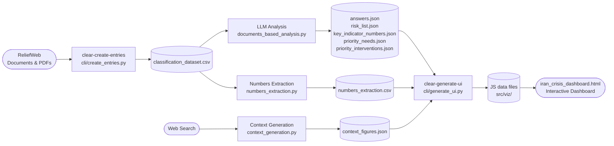
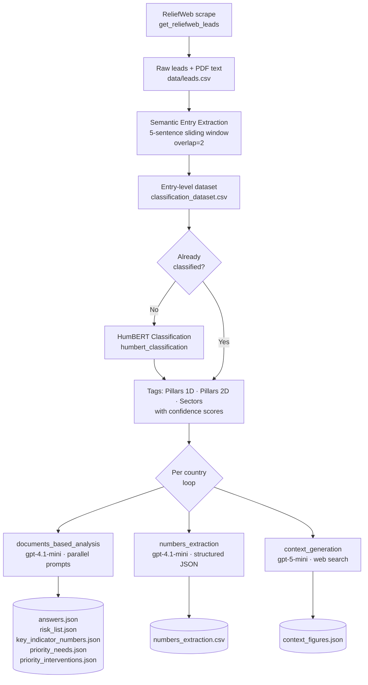
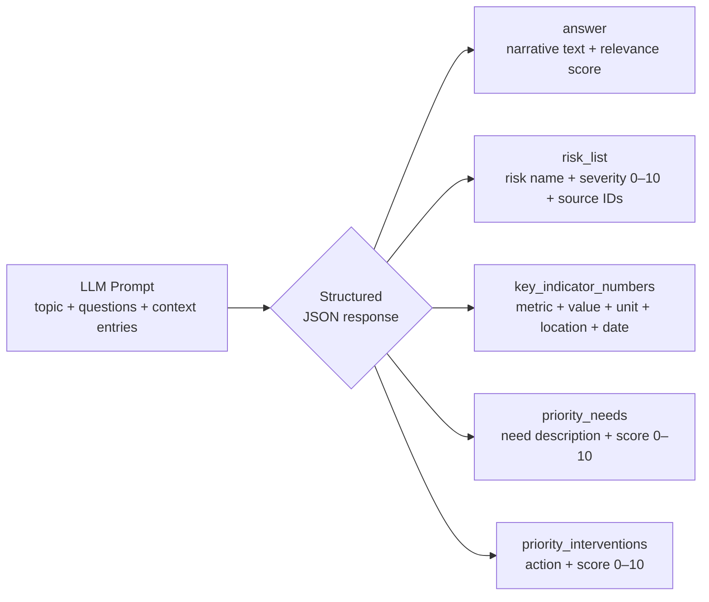
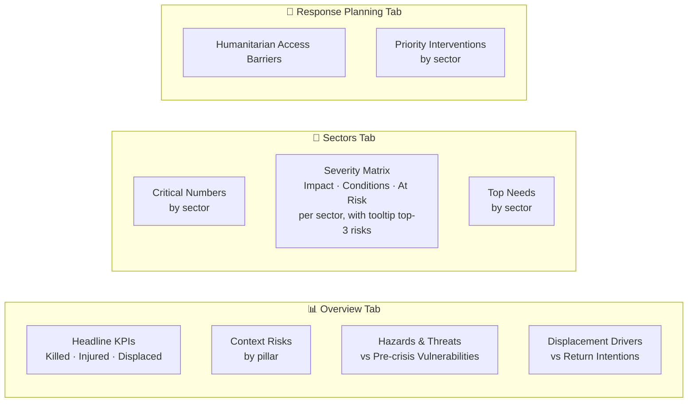

# CLEAR — Automated Situation Analysis

**CLEAR** (Crisis-Led Evidence and Analysis for Response) is a two-stage pipeline that turns raw humanitarian documents into a fully interactive, downloadable situation analysis dashboard, following the [NRC Situation Analysis Framework (SAF)](https://www.nrc.no/).

---

## Pipeline Overview



---

## Stage 1 — `1-create_entries_dataset.py`

Ingests raw documents and produces structured analysis outputs.



### Entry Classification Tags

Each extracted entry is tagged across three dimensions simultaneously by HumBERT:

| Dimension | Tags |
|---|---|
| **Pillars 1D** | Displacement → Push/Pull/Intentions/Local Integration<br>Shock-Event → Type, Hazards, Underlying Factors, Mitigating Factors<br>Humanitarian Access → Constraints, Physical, Population↔Relief |
| **Pillars 2D** | Impact · Humanitarian Conditions · At Risk |
| **Sectors** | Agriculture · Education · Food Security · Health · Livelihoods · Logistics · Nutrition · Protection · Shelter · WASH |

### LLM Analysis — What the Model Produces

For every `(pillar/subpillar, sector)` combination that has relevant entries, a prompt is sent to `gpt-4.1-mini` with the top-N most relevant entries as context. Each response returns a structured JSON with five outputs:



### Numbers Extraction

A separate pass runs `gpt-4.1-mini` specifically on entries tagged as containing casualty or displacement figures. Each number is extracted with full context:

```
number · unit · what_happened · start/end date+precision · start/end location · quantifier · risk_score
```

### Context Generation (Web-Search)

`context_generation.py` uses `gpt-5-mini` with live web search to answer 9 structural context questions per country (Demographics, Political, Economy, Socio-culture, Security, Legal & policy, Infrastructure, Environment, Humanitarian Coordination), producing `context_figures.json`.

---

## Stage 2 — `2-generate_UI_results.py`

Reads all analysis JSON/CSV outputs and generates the JavaScript data files that power the dashboard. Each function applies severity filtering to keep only the most critical information.

```mermaid
flowchart TD
    subgraph Inputs
        A1[(answers.json)]
        A2[(risk_list.json)]
        A3[(key_indicator_numbers.json)]
        A4[(priority_needs.json)]
        A5[(priority_interventions.json)]
        A6[(numbers_extraction.csv)]
        A7[(context_figures.json)]
        A8[(classification_dataset.csv)]
    end

    subgraph "JS Data Files → src/viz/"
        B1[shown_risks_data.js\nSeverity matrix: Pillar 2D × Sector\nTop-3 risks per cell]
        B2[humanitarian_access_data.js\nAccess barriers with score ≥ 8]
        B3[key_sector_numbers_data.js\nCritical numbers: score ≥ 8, value > 100]
        B4[current_hazards_and_threats_data.js\nHazard & Threats subpillar]
        B5[precrisis_vulnerabilities_data.js\nUnderlying-Aggravating Factors]
        B6[displacement_risks_data.js\nTop-4 Push Factors & Intentions]
        B7[top_sectoral_needs_data.js\nNeeds with score ≥ 9, by sector]
        B8[top_priority_interventions_data.js\nInterventions with score ≥ 9, by sector]
        B9[displacement_data.js\nDisplacement counts: score ≥ 9]
        B10[final_numbers_data.js\nMax figures per event type: score ≥ 8]
        B11[top_5_sources_data.js\nMost-cited source documents]
        B12[output_context_risks_data.js\nContext risks with score ≥ 9]
    end

    A2 --> B1
    A2 --> B2
    A2 --> B4
    A2 --> B5
    A2 --> B6
    A3 --> B2
    A3 --> B3
    A4 --> B7
    A5 --> B8
    A6 --> B9
    A6 --> B10
    A1 & A8 --> B11
    A7 --> B12
```



### Severity Filter Logic

| Output | Threshold |
|---|---|
| Sector severity matrix | Max score per (Pillar 2D, Sector) pair, any score |
| Humanitarian access barriers | `risk_score ≥ 8` |
| Critical sector numbers | `risk_score ≥ 8` AND `number > 100` |
| Top sectoral needs | `priority_need_score ≥ 9` |
| Top priority interventions | `priority_intervention_score ≥ 9` |
| Displacement figures | `risk_score ≥ 9` AND `number > 100` |
| Final headline numbers | `risk_score ≥ 8` AND `number > 100` |
| Context risks | `risk_score ≥ 9` |

---

## Dashboard — `src/viz/iran_crisis_dashboard.html`

A self-contained HTML file that loads the JS data files and renders three interactive tabs. No server required — open directly in a browser or share as a standalone file.



The dashboard supports **country switching** (Lebanon / Iran) and a **one-click PDF export** that renders all three tabs into a print-ready document.

---

## Repository Structure

```
CLEAR-AutomatedAnalysis/
├── cli/
│   ├── create_entries.py            # Stage 1: data ingestion & analysis  →  uv run clear-create-entries
│   └── generate_ui.py               # Stage 2: dashboard data generation  →  uv run clear-generate-ui
│
├── src/
│   ├── analysis/
│   │   ├── analytical_questions.py  # All SAF pillar/subpillar question definitions
│   │   ├── documents_based_analysis.py  # LLM prompting & output parsing
│   │   ├── numbers_extraction.py    # Structured numerical data extraction
│   │   ├── context_generation.py    # Web-search context generation
│   │   └── merge_numbers.py         # Number deduplication logic
│   └── viz/
│       ├── iran_crisis_dashboard.html   # Interactive dashboard
│       └── *.js                         # Generated data files (output of Stage 2)
│
└── data/
    ├── leads.csv                    # Raw document metadata
    └── {ProjectName}/
        ├── classification_dataset.csv   # Entries + HumBERT tags
        ├── pdf_files/               # Downloaded PDF documents
        └── analysis/
            └── {Country}/
                ├── answers.json
                ├── risk_list.json
                ├── key_indicator_numbers.json
                ├── priority_needs.json
                ├── priority_interventions.json
                ├── numbers_extraction.csv
                ├── context_figures.json
                └── shown_risks.json
```

---

## Running the Pipeline

**Prerequisites:** set `openai_api_key` in a `.env` file at the repo root.

Install dependencies with [uv](https://docs.astral.sh/uv/):

```bash
uv sync
```

### Stage 1 — Build the analysis dataset

```bash
uv run clear-create-entries \
  --project_name WestAsia2026 \
  --countries_to_analyze Lebanon \
  --n_kept_entries 12 \
  --sample_bool false
```

| Argument | Default | Description |
|---|---|---|
| `--project_name` | `WestAsia2026` | Name of the project / data subfolder |
| `--countries_to_analyze` | `Lebanon` | Comma-separated list of countries |
| `--n_kept_entries` | `12` | Max entries per analysis prompt (higher = richer but slower) |
| `--sample_bool` | `true` | `true` uses a small sample for testing |

Each sub-step is **idempotent** — if the output file already exists it is skipped, so you can resume interrupted runs safely.

### Stage 2 — Generate dashboard data

```bash
uv run clear-generate-ui --country Lebanon
```

### View the dashboard

Open `src/viz/iran_crisis_dashboard.html` directly in any browser. All data files must be in the same `src/viz/` folder.

---

## External Dependencies

| Library | Role |
|---|---|
| `entry_extraction` | Semantic sliding-window entry segmentation |
| `humanitarian_extract_classificator` | HumBERT multilingual entry classification |
| `data_connectors` | ReliefWeb scraping + PDF text extraction |
| `llm_multiprocessing_inference` | Parallel LLM calls with structured output parsing |
| `openai` | GPT-4.1-mini (analysis) + GPT-5-mini with web search (context) |

---

## What's Next

See [`next-steps.md`](next-steps.md) for planned improvements, including NLP model retraining on multilingual data, recommended actions, forecasting, and scenario modelling.
